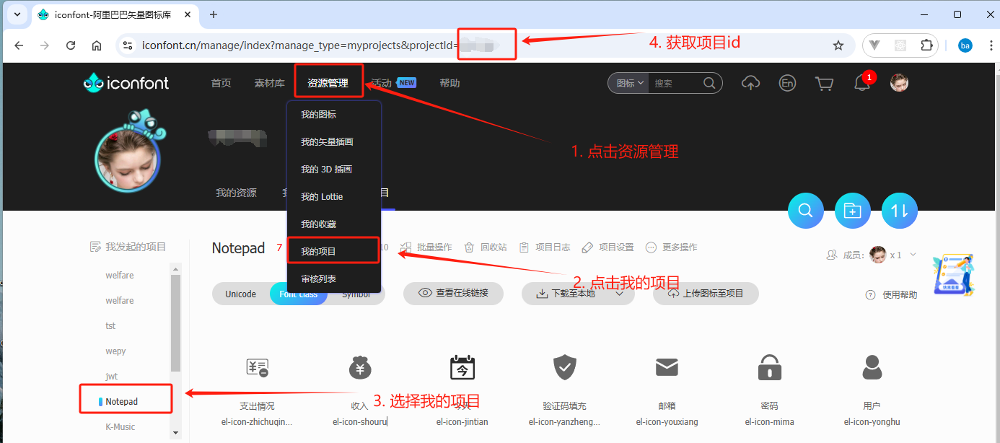
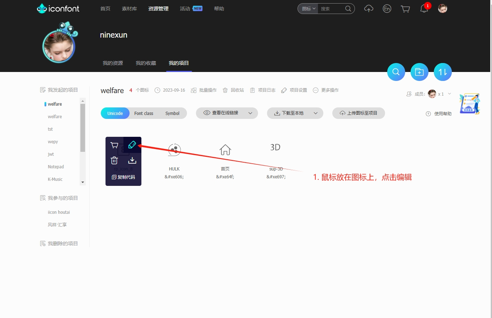
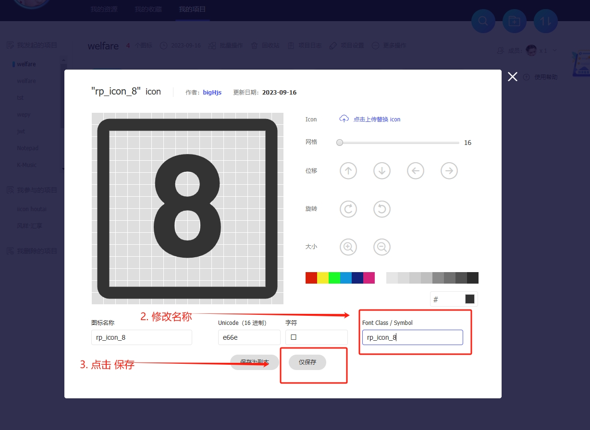

# create-iconfont-component

本项目是根据 [Iconfont](https://www.iconfont.cn) 上的图标在项目中生成 `React` 或者 `Vue` 组件，方便大家使用。

## 使用方式一(推荐)

1. 在项目根目录新增 `iconfont.json` 文件

```json
[
 {
  "projectName": "project",
  "iconfontId": 000,
  "projectType": "react",
  "projectLanguage": "Typescript",
  "svgClass": "demo"
 }
]
```

> `iconfont.json` 类型为 `Array<Object>`

> > Object 详情

| 参数名称        | 类型   | 示例                                                                             |
| :-------------- | :----- | :------------------------------------------------------------------------------- |
| projectName     | string | "demo"<br/>项目名称,支持 a-zA-Z 命名                                             |
| iconfontId      | number | 123<br/>iconfont 项目 id <br/>1. 登录 [iconfont](https://www.iconfont.cn) 官网  <br/> 2. 点击 资源管理 —— 我的项目 <br/> 3. 获取浏览器url中的 projectId                                   |
| projectType     | string | "react"<br/>项目使用框架，支持 `react` 或者 `vue`                                |
| componentPath   | string | "./src/components"<br/>iconfont 生成位置，最终位置由 componentPath + projectName |
| projectLanguage | string | "Typescript"<br/>项目使用语言，支持 `Typescript` 或者 `JavaScript`               |

2. 安装 `create-iconfont-component`

```bash
npm install -D create-iconfont-component
```

3. 在项目 `package.json` 中新增

```json
 "scripts": {
    ...
    "iconfont": "create-iconfont-component"
  },
```

3. 项目终端执行

```bash
npm run iconfont
```

## 使用方式二

1. 项目终端执行以下命令

```bash
npx create-iconfont-component
```

2. 按照提示填写信息

```text
✔ 请输入项目名称 projecta
✔ 请输入Iconfont项目Id 0
✔ 请选择项目应用框架 React
✔ 项目开发语言 Typescript
✔ 请输入组件生成位置 ./dist
✔ 请输入svg className前缀
✔ 是否生成预览文件 是
```

## FAQ

1. 如何获取iconfontId

```md
1. 登录 [iconfont](https://www.iconfont.cn) 官网  
2. 点击 资源管理 —— 我的项目
3. 获取浏览器url中的 
```



2. 如何修改组件名称

```md
本插件生成组件名称： Icon + (iconfont项目中的icon的class名称，`-` `_` 设置去掉成为大驼峰命名)
1. 登录 [iconfont](https://www.iconfont.cn) 官网  
2. 点击 资源管理 —— 我的项目
3. 鼠标放在 icon 上，点击 编辑icon
4. 修改 `Font Class / Symbol` 输入框文本
5. 点击 `仅保存`
```




3. 如何修改组件 `svg` 标签的样式

```md
1. 项目配置文件可设置 svg 的class名称
2. 项目入口配置 该class的style
```
